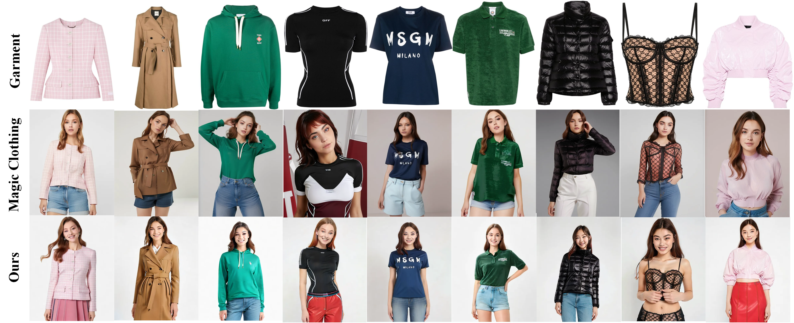
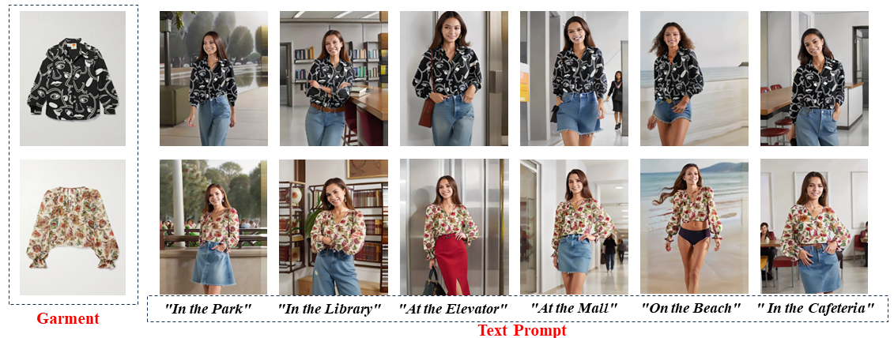

# **👔IMAGDressing👔: Interactive Modular Apparel Generation for Virtual Dressing**


## 📦️ Release
- [2024/07/16] 🔥 We add the batch inference for [full VD](https://github.com/muzishen/IMAGDressing/blob/main/inference_IMAGdressing_controlnetinpainting_folder.py) and [VTON](https://github.com/muzishen/IMAGDressing/blob/main/inference_IMAGdressing_ipa_controlnetpose_folder.py). Thanks @ZhaoChaoqun for the contribution.
- [2024/07/01] 🔥 We release the test cases in the assets/images directory.
- [2024/06/21] 🔥 We release the inpainting feature to enable outfit changing. **[Experimental Feature](assets/inpainting.png)**.
- [2024/06/13] 🔥 We release the [Gradio_demo](https://sf.dictdoc.site/) of IMAGDressing-v1.
- [2024/05/28] 🔥 We release the inference code of SD1.5 that is compatible with [IP-Adapter](https://github.com/tencent-ailab/IP-Adapter) and [ControlNet](https://github.com/lllyasviel/ControlNet).
- [2024/05/08]  🔥 We launch the [project page](https://imagdressing.github.io/) of IMAGDressing-v1.

---

## IMAGDressing-v1: Customizable Virtual Dressing
<a href='https://imagdressing.github.io/'></a>
<a href='http://arxiv.org/abs/2407.12705'></a>
<a href='https://huggingface.co/feishen29/IMAGDressing'></a>
[](https://github.com/muzishen/IMAGDressing)


### 🚀 **Key Features:**
1. **Simple Architecture**: IMAGDressing-v1 produces lifelike garments and enables easy user-driven scene editing. 
2. **Flexible Plugin Compatibility**: IMAGDressing-v1 modestly integrates with extension plugins such as [IP-Adapter](https://github.com/tencent-ailab/IP-Adapter), [ControlNet](https://github.com/lllyasviel/ControlNet), [T2I-Adapter](https://github.com/TencentARC/T2I-Adapter), and [AnimateDiff](https://github.com/guoyww/AnimateDiff).
3. **Rapid Customization**: Enables rapid customization in seconds without the need for additional LoRA training.


## 🔥 **Examples**

<div style="display: flex; justify-content: space-around;">
  
  
  
    
</div>




### <span style="color:red">Conbined with IP-Adapter and Contorlnet-Pose</span>


### <span style="color:red">Support text prompts for different scenes</span>


### <span style="color:red">Supports outfit changing in specified areas (Experimental Feature)</span>


## 🏷️  Introduction

To address the need for flexible and controllable customizations in virtual try-on systems, we propose IMAGDressing-v1. Specifically, we introduce a garment UNet that captures semantic features from CLIP and texture features from VAE. Our hybrid attention module includes a frozen self-attention and a trainable cross-attention, integrating these features into a frozen denoising UNet to ensure user-controlled editing. We will release a comprehensive dataset, IGv1, with over 300,000 pairs of clothing and dressed images, and establish a standard data assembly pipeline. Furthermore, IMAGDressing-v1 can be combined with extensions like ControlNet, IP-Adapter, T2I-Adapter, and AnimateDiff to enhance diversity and controllability. 


## 🔧 Requirements

- Python >= 3.8 (Recommend to use [Anaconda](https://www.anaconda.com/download/#linux) or [Miniconda](https://docs.conda.io/en/latest/miniconda.html))
- [PyTorch >= 2.0.0](https://pytorch.org/)
- cuda==11.8

```bash
conda create --name IMAGDressing python=3.8.10
conda activate IMAGDressing
pip install -U pip

# Install requirements
pip install -r requirements.txt
```

---


## 🌐 Download Models
You can download our models from [HuggingFace](https://huggingface.co/feishen29/IMAGDressing) or [百度云](https://pan.baidu.com/s/1-69aFUjtrsGnD0OlU0dMzQ?pwd=imag).  You can download the other component models from the original repository, as follows.
- [stabilityai/sd-vae-ft-mse](https://huggingface.co/stabilityai/sd-vae-ft-mse).
- [SG161222/Realistic_Vision_V4.0_noVAE](https://huggingface.co/SG161222/Realistic_Vision_V4.0_noVAE).
- [h94/IP-Adapter-FaceID](https://huggingface.co/h94/IP-Adapter-FaceID).
- [lllyasviel/control_v11p_sd15_openpose](https://huggingface.co/lllyasviel/control_v11p_sd15_openpose).
## 🎉 How to Use

### <span style="color:red">Important Reminder</span>


### 1. Random faces and poses to dress the assigned clothes 

```sh
python inference_IMAGdressing.py --cloth_path [your cloth path]
```


### 2. Random faces use a given pose to dress a given outfit 

```sh
python inference_IMAGdressing_controlnetpose.py --cloth_path [your cloth path] --pose_path [your posture path]
```

### 3. Specify the face and posture to wear the specified clothes

```sh
python inference_IMAGdressing_ipa_controlnetpose.py --cloth_path [your cloth path] --face_path [your face path] --pose_path [your posture path]
```

### 4. Specify the model to wear the specified clothes (Experimental Feature)
<span style="color:red">Please download the humanparsing and openpose model file from [IDM-VTON-Huggingface](https://huggingface.co/spaces/yisol/IDM-VTON/tree/main) to the ckpt folder first.</span>
```sh
python inference_IMAGdressing_controlnetinpainting.py --cloth_path [your cloth path] --model_path [your model path]
```


## 📚 Get Involved
Join us on this exciting journey to transform virtual try-on systems. Star⭐️ our repository to stay updated with the latest advancements, and contribute to making **IMAGDressing** the leading solution for virtual clothing generation.


## Acknowledgement
We would like to thank the contributors to the [IDM-VTON](https://github.com/yisol/IDM-VTON), [MagicClothing](https://github.com/ShineChen1024/MagicClothing), [IP-Adapter](https://github.com/tencent-ailab/IP-Adapter), [ControlNet](https://github.com/lllyasviel/ControlNet), [T2I-Adapter](https://github.com/TencentARC/T2I-Adapter), and [AnimateDiff](https://github.com/guoyww/AnimateDiff) repositories, for their open research and exploration.

The IMAGDressing code is available for both academic and commercial use. However, the models available for manual and automatic download from IMAGDressing are intended solely for non-commercial research purposes. Similarly, our released checkpoints are restricted to research use only. Users are free to create images using this tool, but they must adhere to local laws and use it responsibly. The developers disclaim any liability for potential misuse by users.

## 📝 Citation

If you find IMAGDressing-v1 useful for your research and applications, please cite using this BibTeX:

```bibtex
@article{shen2024IMAGDressing-v1,
  title={IMAGDressing-v1: Customizable Virtual Dressing},
  author={Shen, Fei and Jiang, Xin and He, Xin and Ye, Hu and Wang, Cong, and Du, Xiaoyu, Li Zechao, and Tang, Jinghui},
  booktitle={arXiv preprint arXiv:2407.12705},
  year={2024}
}
```

## 🕒 TODO List
- [x] Gradio demo
- [x] Inference code
- [x] Model weights (512 sized version)
- [x] Support inpaint
- [ ] Model weights (More higher sized version)
- [x] Paper
- [ ] Training code
- [ ] Video Dressing
- [ ] Others, such as User-Needed Requirements

## 📨 Contact
If you have any questions, please feel free to contact with me at shenfei140721@126.com.
